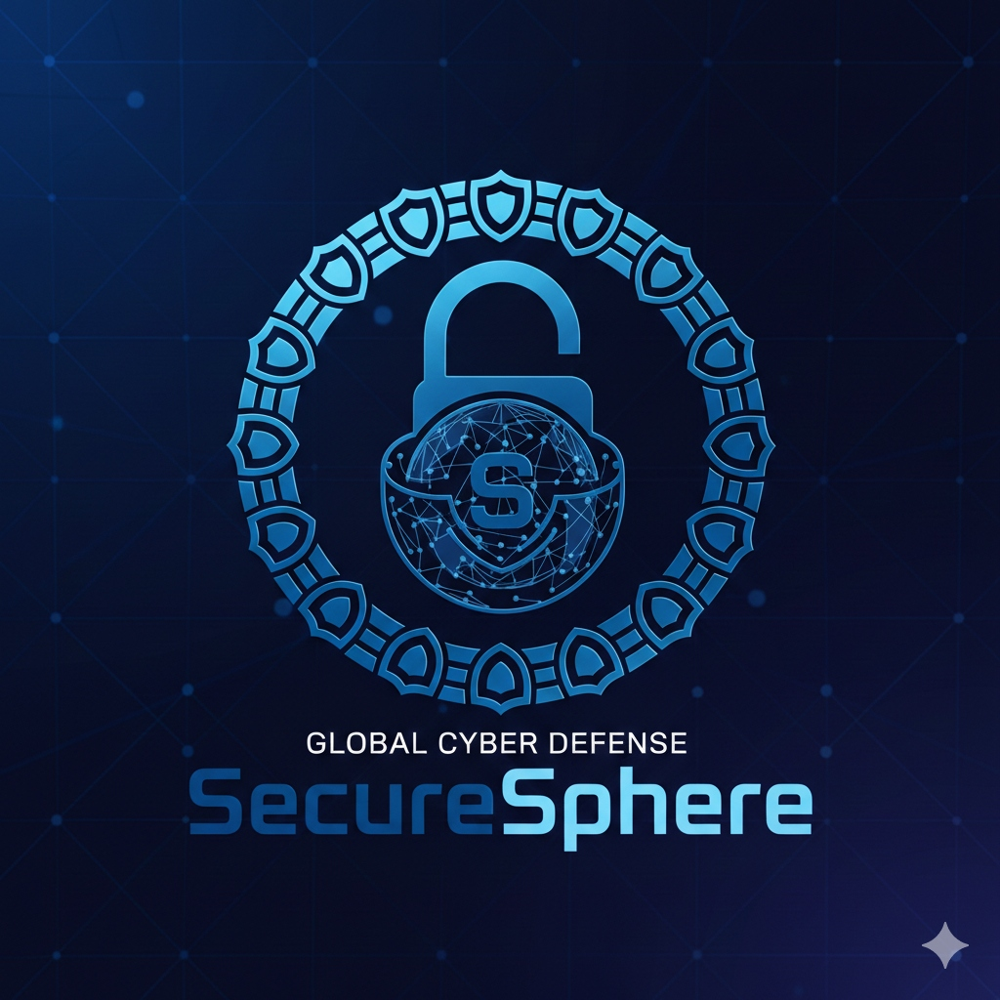

# ✅ Certificate Design Updated!

## Changes Made

### 1. New Logo ✅
- **Before**: Generic SVG shield logo
- **After**: Your professional SecureSphere logo with padlock and shield design
- Logo file: `securesphere-logo.jpg`

### 2. PDF Download ✅
- **Before**: Downloaded as HTML file
- **After**: Downloads as professional PDF using html2pdf.js library
- Filename format: `SecureSphere_Certificate_[ID].pdf`
- High quality (0.98 JPEG quality, 2x scale)
- A4 landscape orientation

### 3. Removed Seal ✅
- **Before**: Had checkmark (✓) seal in bottom right
- **After**: Clean professional design without seal
- More minimalist and modern look

---

## Technical Details

### Logo Implementation
```html

```

### PDF Library Added
```html
<script src="https://cdnjs.cloudflare.com/ajax/libs/html2pdf.js/0.10.1/html2pdf.bundle.min.js"></script>
```

### PDF Generation Function
```javascript
function downloadCertificate() {
  const element = document.getElementById('certificateContent');
  const certId = document.getElementById('certId').textContent.replace('Certificate ID: ', '');
  
  const clone = element.cloneNode(true);
  const actions = clone.querySelector('.cert-actions');
  if (actions) actions.remove();
  
  const opt = {
    margin: 10,
    filename: `SecureSphere_Certificate_${certId}.pdf`,
    image: { type: 'jpeg', quality: 0.98 },
    html2canvas: { scale: 2, useCORS: true },
    jsPDF: { unit: 'mm', format: 'a4', orientation: 'landscape' }
  };
  
  html2pdf().set(opt).from(clone).save();
}
```

---

## Deployment

### Git Commit
```
Commit: 49896e6
Message: Update certificate design - New logo, PDF download, remove seal
Files Changed: 3 files
- learn.html (updated)
- securesphere-logo.jpg (new)
- task.md (updated)
```

### Pushed to GitHub
✅ Successfully pushed to `DJ018/SecureSphere` (main branch)
✅ Vercel auto-deployment triggered

---

## Certificate Features (Complete)

### Design Elements
✅ Professional SecureSphere logo at top
✅ Organization name (SecureSphere)
✅ Certificate title
✅ Recipient name (prominently displayed)
✅ Module name
✅ Completion text
✅ Issue date
✅ Unique certificate ID (SS-XXXXX-XXXX format)
✅ Professional border and styling
✅ Decorative corner ornaments
✅ Clean, minimalist design (no seal)

### Functionality
✅ Download as PDF (high quality)
✅ Print certificate
✅ Close modal

---

## How to Test

1. Go to your deployed website
2. Open `learn.html`
3. Complete any module quiz (pass with 70%+)
4. Generate certificate
5. Click "📥 Download Certificate"
6. **Result**: PDF file downloads automatically!

### Expected PDF
- Filename: `SecureSphere_Certificate_SS-XXXXX-XXXX.pdf`
- Format: A4 landscape
- Quality: High resolution
- Content: Your new logo, all certificate details, no seal

---

## Before vs After

### Logo
- **Before**: Generic SVG shield
- **After**: Professional SecureSphere logo with padlock and shield ring

### Download
- **Before**: HTML file (hard to share)
- **After**: PDF file (professional, shareable)

### Design
- **Before**: Had checkmark seal
- **After**: Clean, minimalist (no seal)

---

## Summary

🎉 **All Certificate Updates Complete!**

✅ New professional logo integrated
✅ PDF download functionality working
✅ Checkmark seal removed
✅ Committed and deployed (commit 49896e6)
✅ Vercel deployment in progress

**Your certificates now look more professional and download as PDFs!**

Check your Vercel dashboard - deployment should complete in 2-5 minutes!
